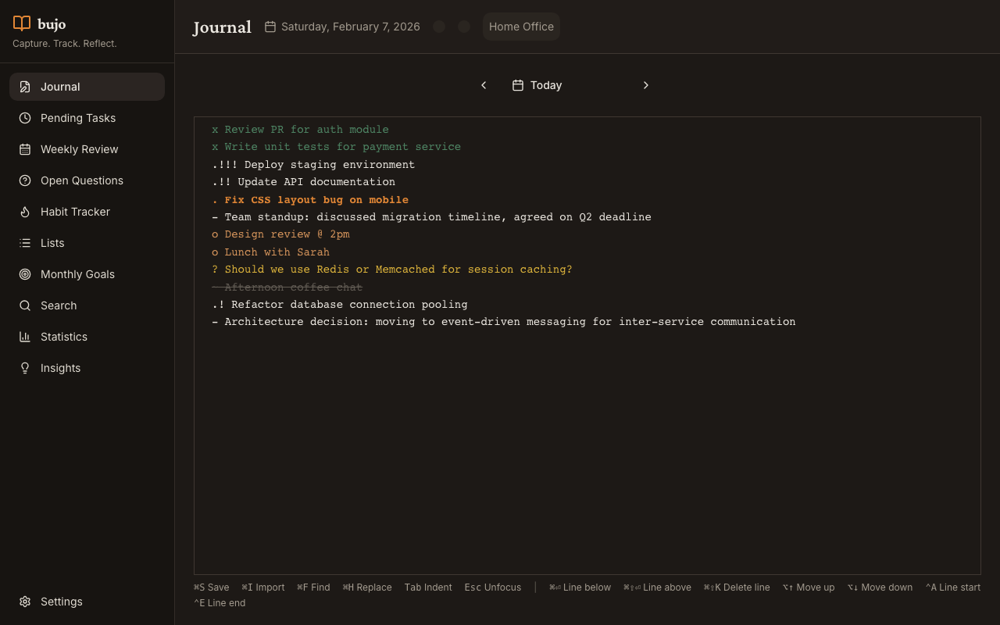

# bujo

[](https://github.com/typingincolor/bujo/actions/workflows/ci.yml)
[](https://github.com/typingincolor/bujo/actions/workflows/nightly.yml)
[](https://github.com/typingincolor/bujo/actions/workflows/security.yml)
[](https://codecov.io/gh/typingincolor/bujo)
[](https://goreportcard.com/report/github.com/typingincolor/bujo)
[](https://go.dev/)
[](https://opensource.org/licenses/MIT)
[](https://github.com/typingincolor/bujo/releases)
[](https://github.com/typingincolor/bujo/commits/main)
[](https://github.com/typingincolor/bujo)

A command-line Bullet Journal for rapid task capture, habit tracking, and AI-powered reflections.



## Interfaces

bujo provides three ways to interact with your journal:

| Interface | Description | Documentation |
|-----------|-------------|---------------|
| **CLI** | Command-line for scripting and power users | [docs/CLI.md](docs/CLI.md) |
| **TUI** | Interactive terminal UI with keyboard shortcuts | [docs/TUI.md](docs/TUI.md) |
| **Desktop App** | Native macOS app with modern GUI | [docs/FRONTEND.md](docs/FRONTEND.md) |

## Features

- **Rapid Entry** - Add tasks, notes, and events with simple symbols (`. task`, `- note`, `o event`)
- **Hierarchical Notes** - Indent entries to create parent-child relationships
- **Habit Tracking** - Track daily habits with streaks and completion rates
- **List Management** - Organize items in separate lists (shopping, projects, etc.)
- **Monthly Goals** - Set and track goals by month
- **Day Context** - Record location, mood, and weather
- **Local AI Summaries** - Generate journal reflections with complete privacy (runs offline)
- **Backup & Restore** - Built-in database backups with version history

## Installation

### Homebrew (macOS)

```bash
brew tap typingincolor/tap
brew install bujo
```

### Desktop App (macOS)

```bash
brew tap typingincolor/tap
brew install --cask bujo-desktop
```

### Go Install

```bash
go install github.com/typingincolor/bujo/cmd/bujo@latest
```

### Download Binary

Download from [GitHub Releases](https://github.com/typingincolor/bujo/releases) for:
- macOS (Intel and Apple Silicon)
- Linux (amd64 and arm64)
- Windows (amd64)

### Building from Source

See [BUILD.md](BUILD.md) for build instructions.

## Quick Start

```bash
# Add tasks for today
bujo add ". Buy groceries"
bujo add ". Finish report" "- Remember to include Q4 data"

# View today's entries
bujo today

# Launch interactive TUI
bujo tui

# Log a habit
bujo habit log Gym

# View habit tracker
bujo habit
```

## Entry Types

| Symbol | Type | Description |
|--------|------|-------------|
| `.` | Task | A todo item to be completed |
| `-` | Note | Information or observation |
| `o` | Event | A scheduled occurrence |
| `x` | Done | A completed task |
| `>` | Migrated | A task moved to another day |
| `~` | Cancelled | A task no longer relevant |
| `?` | Question | An open question to be answered |
| `★` | Answered | A question that has been answered |

## Documentation

**Getting Started:**
- [Quick Start](docs/QUICKSTART.md) - Get started in 5 minutes
- [Common Workflows](docs/WORKFLOWS.md) - Practical usage patterns

**Interfaces:**
- [CLI Reference](docs/CLI.md) - Complete command documentation
- [TUI Guide](docs/TUI.md) - Interactive terminal UI shortcuts
- [Desktop App](docs/FRONTEND.md) - Native application guide

**Reference:**
- [Data Management](docs/DATA.md) - Backup, export, and storage
- [AI Setup](docs/AI_SETUP.md) - Configure local or cloud AI
- [Troubleshooting](docs/TROUBLESHOOTING.md) - Common issues and solutions
- [Architecture](docs/ARCHITECTURE.md) - Technical design overview

## Data Storage

bujo stores all data in a SQLite database at `~/.bujo/bujo.db`. Use `--db-path` to specify a different location.

### Backup

```bash
bujo backup create              # Create backup
bujo backup                     # List backups
bujo backup verify <path>       # Verify integrity
```

## Shell Completions

```bash
# Bash
source <(bujo completion bash)

# Zsh
source <(bujo completion zsh)

# Fish
bujo completion fish | source
```

## License

MIT
